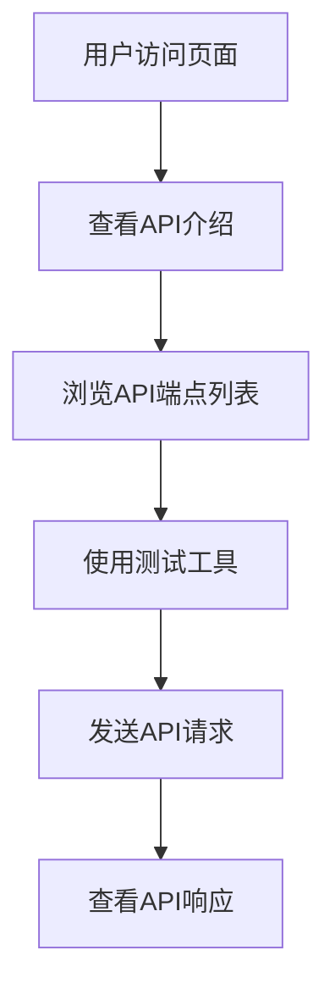

## 1. Product Overview
一个简单的API示例项目，用于演示API的基本概念和使用方法。
- 帮助用户理解API的定义、工作原理和调用方式
- 提供实际可运行的API示例，包含基本的CRUD操作

## 2. Core Features

### 2.1 User Roles
| Role | Registration Method | Core Permissions |
|------|---------------------|------------------|
| 访客 | 无需注册 | 可调用所有API端点 |

### 2.2 Feature Module
1. **API演示页面**: API介绍、端点列表、测试工具
2. **API后端**: 提供RESTful API接口

### 2.3 Page Details
| Page Name | Module Name | Feature description |
|-----------|-------------|---------------------|
| API演示页面 | 介绍区 | 解释API概念和本项目的目的 |
| API演示页面 | 端点列表 | 展示所有可用的API端点及其功能 |
| API演示页面 | 测试工具 | 允许用户直接在页面上测试API调用 |
| API后端 | 数据接口 | 提供用户数据的CRUD操作 |

## 3. Core Process
用户访问API演示页面，了解API概念，查看可用的API端点，然后使用测试工具进行API调用，观察响应结果。

## 4. User Interface Design
### 4.1 Design Style
- 主色调: #3b82f6 (蓝色)
- 辅助色: #10b981 (绿色)
- 按钮样式: 圆角矩形，有hover效果
- 字体: Inter，大小16px
- 布局风格: 卡片式布局，清晰的层次结构
- 图标风格: 简约线性图标

### 4.2 Page Design Overview
| Page Name | Module Name | UI Elements |
|-----------|-------------|-------------|
| API演示页面 | 介绍区 | 大标题，简短描述，背景渐变色 |
| API演示页面 | 端点列表 | 卡片式展示，每个端点包含方法、路径、描述 |
| API演示页面 | 测试工具 | 表单输入，请求方法选择，响应展示区 |

### 4.3 Responsiveness
- 桌面端优先设计
- 移动端自适应布局
- 触摸优化的按钮和输入框

### 4.4 3D Scene Guidance
- 不适用