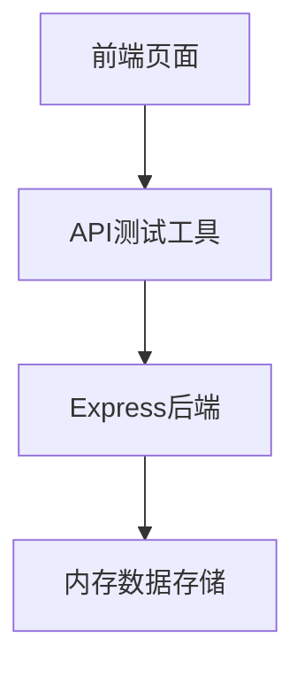
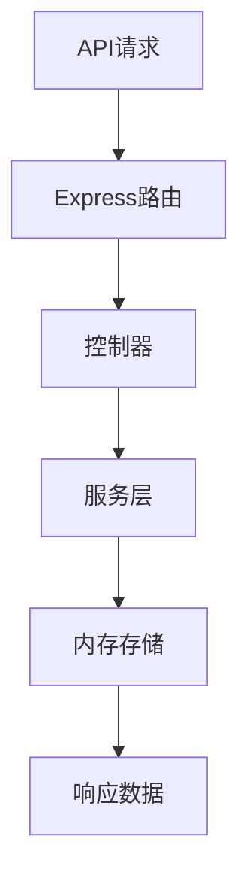
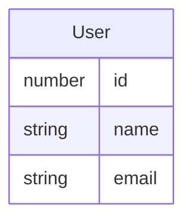

## 1. Architecture Design


## 2. Technology Description
- Frontend: React@18 + tailwindcss@3 + vite
- Initialization Tool: vite-init
- Backend: Express@4
- Database: 内存存储 (用于演示)

## 3. Route Definitions
| Route | Purpose |
|-------|---------|
| / | API演示页面 |
| /api/users | 用户数据API |

## 4. API Definitions

### 4.1 GET /api/users
- 功能: 获取所有用户列表
- 请求参数: 无
- 响应格式:
  ```typescript
  interface User {
    id: number;
    name: string;
    email: string;
  }
  
  type GetUsersResponse = User[];
  ```

### 4.2 GET /api/users/:id
- 功能: 获取指定ID的用户
- 请求参数:
  - id: number (路径参数)
- 响应格式:
  ```typescript
  interface GetUserResponse {
    id: number;
    name: string;
    email: string;
  }
  ```

### 4.3 POST /api/users
- 功能: 创建新用户
- 请求体:
  ```typescript
  interface CreateUserRequest {
    name: string;
    email: string;
  }
  ```
- 响应格式:
  ```typescript
  interface CreateUserResponse {
    id: number;
    name: string;
    email: string;
  }
  ```

### 4.4 PUT /api/users/:id
- 功能: 更新指定ID的用户
- 请求参数:
  - id: number (路径参数)
- 请求体:
  ```typescript
  interface UpdateUserRequest {
    name?: string;
    email?: string;
  }
  ```
- 响应格式:
  ```typescript
  interface UpdateUserResponse {
    id: number;
    name: string;
    email: string;
  }
  ```

### 4.5 DELETE /api/users/:id
- 功能: 删除指定ID的用户
- 请求参数:
  - id: number (路径参数)
- 响应格式:
  ```typescript
  interface DeleteUserResponse {
    message: string;
  }
  ```

## 5. Server Architecture Diagram


## 6. Data Model
### 6.1 Data Model Definition


### 6.2 Data Definition Language
- 使用内存存储，无需数据库表结构定义
- 初始数据:
  ```javascript
  const initialUsers = [
    { id: 1, name: '张三', email: 'zhangsan@example.com' },
    { id: 2, name: '李四', email: 'lisi@example.com' },
    { id: 3, name: '王五', email: 'wangwu@example.com' }
  ];
  ```